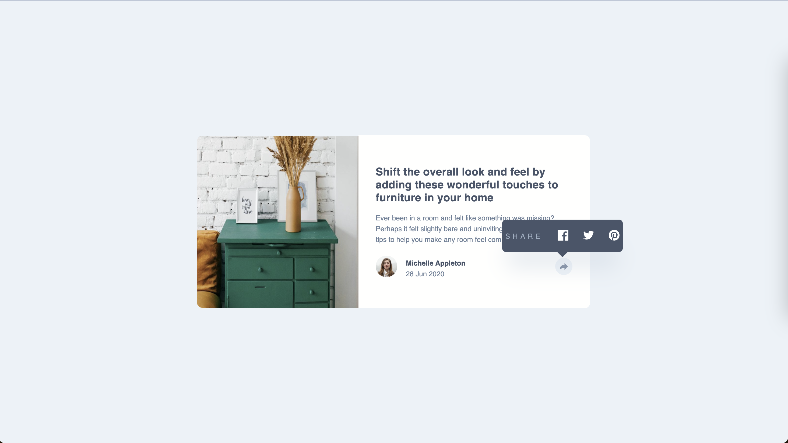
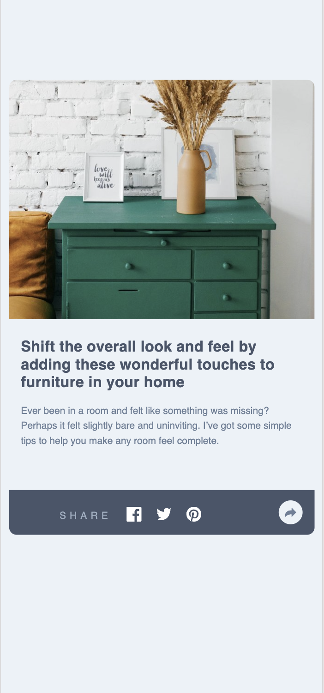

# Article preview component

This is a solution to the [Four card feature section challenge on Frontend Mentor](https://www.frontendmentor.io/challenges/four-card-feature-section-weK1eFYK). Frontend Mentor challenges help you improve your coding skills by building realistic projects. 

## Table of contents
- [Overview](#overview)
  - [The challenge](#the-challenge)
  - [Screenshot](#screenshot)
  - [Links](#links)
- [Author](#author)

## Overview

### The challenge

Developer should use Javascript to enable the share tool tip on Desktop. On the mobile, the click should create a different bar. See screenshots below.

### Screenshot

Desktop         |  Mobile
:-------------------------:|:-------------------------:
  |  

### Links

- [Live site](https://sdkdeepa.github.io/article-preview-component/)

## My process

### Built with
- Semantic HTML5 markup
- CSS custom properties
- Flexbox
- Mobile-first workflow
- JavaScript for share icon interation

## Author

**Frontend Mentor - [@sdkdeepa](https://www.frontendmentor.io/profile/sdkdeepa)**